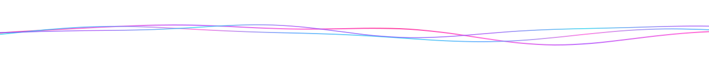
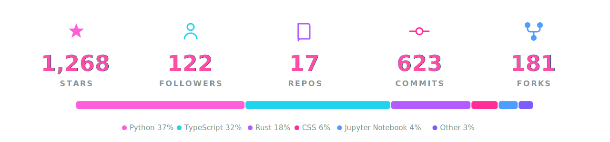

<!--
  GitHub PROFILE README for  github.com/AkshitIreddy   (repo: AkshitIreddy/AkshitIreddy)
  · The banner + divider are hand-generated animated SVGs (transparent, blend with any theme).
  · The stats card is a self-hosted SVG generated from live data by make_stats.py,
    refreshed daily by .github/workflows/stats.yml — no third-party service to break.
-->

<!-- ░░ LIVING WAVE — transparent, animates on GitHub ░░ -->

### Software Engineer specializing in Generative AI Integrations — building Agentic AI for virtual worlds.

